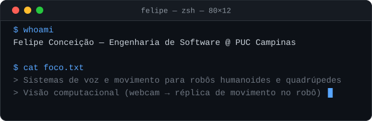
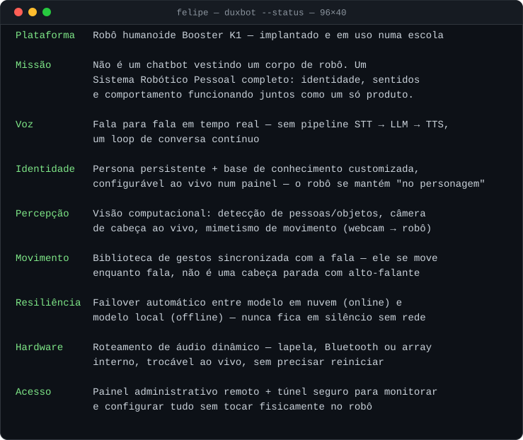
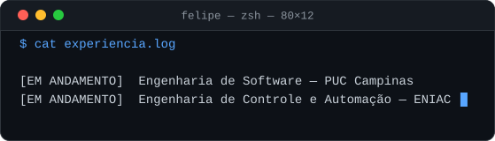

# Felipe Conceição

## `$ whoami`

 
 

## Projeto em Destaque — DUXBOT

 
 

> Construído do zero por mim: o loop de voz, a persona, a parte de visão e movimento. Depois refinado ao lado de um colega, conforme foi saindo do protótipo e virando algo que as pessoas na escola usam de verdade, todos os dias. Não é uma demonstração, é um robô em uso real.

 

## `$ cat experiencia.log`

## `$ ls tech-stack/`

 

### Snake de Contribuições

 

---

<strong>🇺🇸 English</strong>

 

### `$ whoami`

 
 

### Featured Project — DUXBOT

 
 

> Built from the ground up as the core system — the voice loop, the persona, the motion/vision stack — then refined alongside a teammate as it went from prototype to something people at the school actually interact with daily. Not a demo, a real deployment.

 

### `$ cat experience.log`

### `$ ls tech-stack/`

