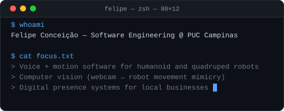
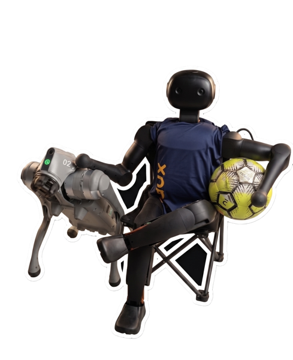
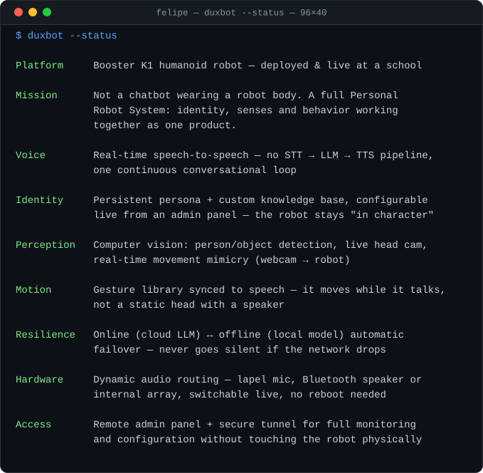
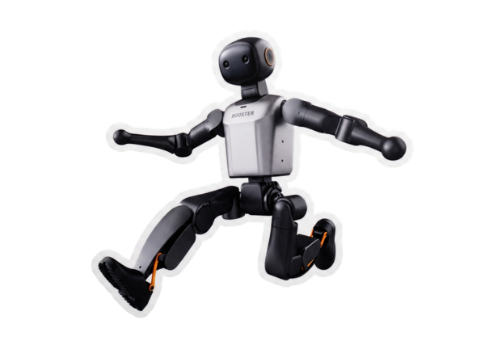
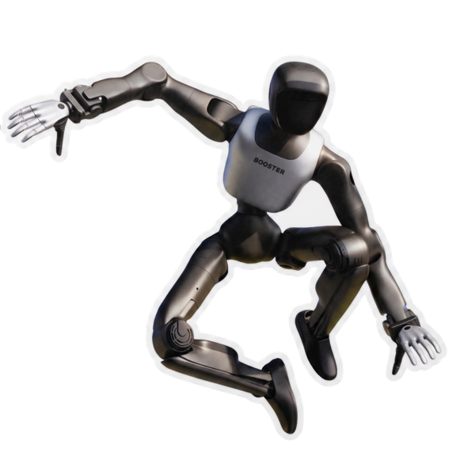
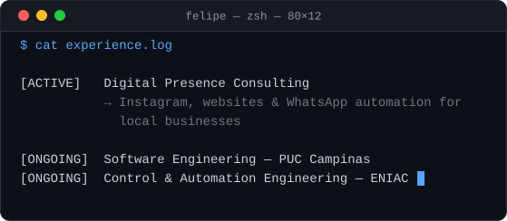

# Felipe Conceição

## `$ whoami`

 
 

## Featured Project — DUXBOT

 
 

> Designed and built solo from the ground up — the voice loop, the persona system, the motion/vision stack and the ops tooling around it. Not a demo: it's a robot people at the school actually interact with daily.

 

## `$ cat experience.log`

## `$ ls tech-stack/`

 

## GitHub Stats

 

### Contribution Snake

 

