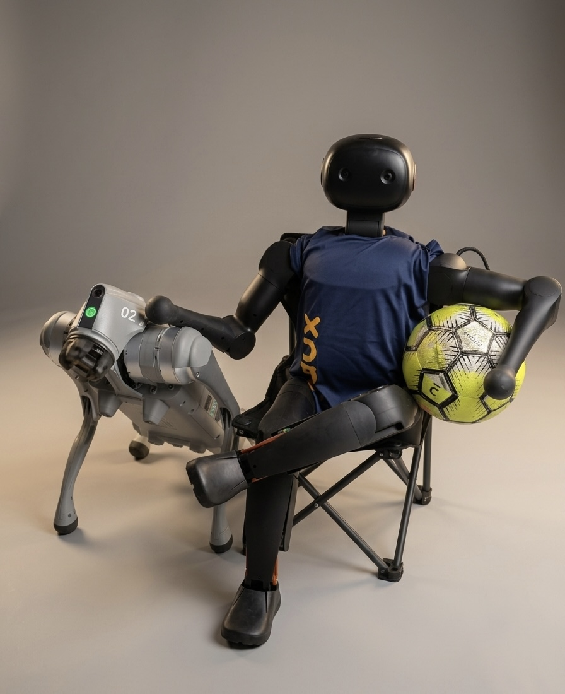

# Felipe Conceição

<a href="https://git.io/typing-svg">
  
</a>

<br clear="both"/>

## `$ whoami`

```bash
$ whoami
Felipe Conceição — Computer Science student @ PUC Campinas

$ cat focus.txt
> Voice + motion software for humanoid and quadruped robots
> Computer vision (webcam → robot movement mimicry)
> Digital presence systems for local businesses
```

## Featured Project — DUXBOT


<a href="https://git.io/typing-svg">
  
</a>

```text
Platform     Booster K1 humanoid robot — deployed & live at a school

Mission      Not a chatbot wearing a robot body. A full Personal
             Robot System: identity, senses and behavior working
             together as one product.

Voice        Real-time speech-to-speech — no STT → LLM → TTS pipeline,
             one continuous conversational loop

Identity     Persistent persona + custom knowledge base, configurable
             live from an admin panel — the robot stays "in character"

Perception   Computer vision: person/object detection, live head cam,
             real-time movement mimicry (webcam → robot)

Motion       Gesture library synced to speech — it moves while it talks,
             not a static head with a speaker

Resilience   Online (cloud LLM) ↔ offline (local model) automatic
             failover — never goes silent if the network drops

Hardware     Dynamic audio routing — lapel mic, Bluetooth speaker or
             internal array, switchable live, no reboot needed

Access       Remote admin panel + secure tunnel for full monitoring
             and configuration without touching the robot physically
```


> Designed and built solo from the ground up — the voice loop, the persona system, the motion/vision stack and the ops tooling around it. Not a demo: it's a robot people at the school actually interact with daily.


<br clear="both"/>

## `$ cat experience.log`

```text
[ACTIVE]   Digital Presence Consulting
           → Instagram, websites & WhatsApp automation for local businesses

[ONGOING]  B.S. Computer Science — PUC Campinas
```

## `$ ls tech-stack/`

<div align="center">

</div>

<br>

## GitHub Stats

<div align="center">


</div>

<br>

### Contribution Snake

<div align="center">

</div>

<br>

<div align="center">

</div>
